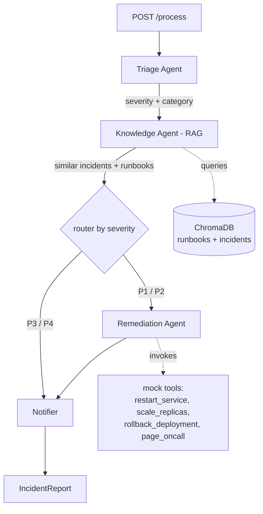

# IncidentIQ

AI-powered DevOps incident triage and resolution. You send it an incident, it
classifies the severity, retrieves similar past incidents and runbooks via RAG,
proposes remediation steps, and for high-severity cases invokes mocked DevOps
tools automatically.

Built with FastAPI + LangGraph + ChromaDB, running on a local Ollama model.

## Architecture



The router after triage is the interesting bit: **P1/P2 incidents go through the
Remediation agent (which invokes tools); P3/P4 skip straight to the Notifier.**

### Agents
| Agent | Job |
|-------|-----|
| Orchestrator (LangGraph) | routes between agents based on severity |
| Triage Agent | classifies severity (P1-P4), category, entities (structured output) |
| Knowledge Agent | RAG over runbooks + historical incidents |
| Remediation Agent | proposes fix steps, invokes tools when severity is high |
| Notifier Agent | formats the final Slack/email-ready response |

## Run it

### Local (Ollama running)
```bash
python -m venv .venv && source .venv/bin/activate   # .venv\Scripts\activate on Windows
pip install -r requirements.txt

ollama pull llama3.1            # one time
cp .env.example .env

python -m app.rag.ingest        # build the vector store once
uvicorn app.main:app --reload
```

### Docker (brings up Ollama too)
```bash
docker compose up --build
docker compose exec ollama ollama pull llama3.1   # first time only
```

### No Ollama? Use the mock
```bash
$env:MOCK_LLM="true"
uvicorn app.main:app --reload
```

## API

| Method | Path | What |
|--------|------|------|
| GET | `/health` | liveness check |
| POST | `/process` | triage + resolve an incident |
| GET | `/runbooks/{category}` | retrieve runbook/incident knowledge (RAG) |
| GET | `/incidents/{id}` | look up a past incident from the corpus |

### Sample calls
```bash
curl localhost:8000/health

# P1 - goes through remediation, tools get invoked
curl -X POST localhost:8000/process -H "content-type: application/json" -d '{
  "id": "INC-900",
  "title": "Checkout API outage - all users affected",
  "description": "500 errors at 100% on /checkout, service down after deploy v2.31"
}'

# P4 - skips remediation, just notifies
curl -X POST localhost:8000/process -H "content-type: application/json" -d '{
  "title": "Informational: maintenance window reminder",
  "description": "Notice only, no action needed"
}'

# pull knowledge straight from the vector store
curl localhost:8000/runbooks/database

# look up a past incident
curl localhost:8000/incidents/INC-101
```

## Data

The RAG corpus lives in `data/`:
- `data/runbooks/` - runbooks per category (database, infra, network, application)
- `data/incidents.json` - historical resolved incidents

Committed so the repo works out of the box. To regenerate the incident set with
the LLM: `python generate_data.py` then re-run the ingest.

## Demo

Send a **P1 database/app outage** -> router sends it to the Remediation agent ->
it pulls the matching runbook + similar past incident, proposes steps, and
invokes `restart_service` / `page_oncall`. Then send a **P4 informational alert**
-> it skips Remediation entirely and goes straight to the Notifier. That
conditional routing is the wow factor.

## Tests
```bash
MOCK_LLM=true pytest -q
```
